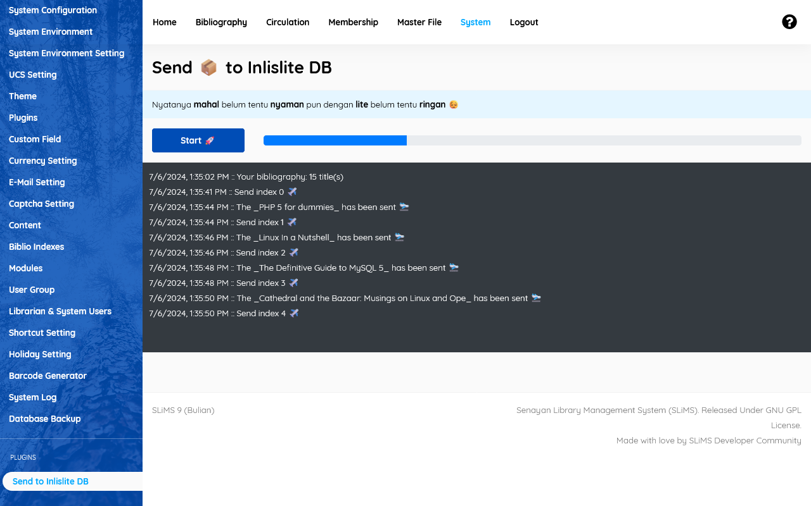

# Send to Inlislite

Plugin ini memungkinkan pengguna SLiMS untuk mengirim data katalog ke Inlislite secara otomatis.



## Prasyarat

Pastikan Anda telah menginstal SLiMS versi 9.6.1 dan Composer di sistem Anda.

## Instalasi

1. Clone Repository

    Clone repository plugin ini ke direktori plugins di instalasi SLiMS Anda:

    ```bash
    git clone https://github.com/idoalit/send-to-inlislite.git /path/to/slims/plugins/send-to-inlislite
    ```
2. Install Dependencies

    Pindah ke direktori plugin dan jalankan Composer untuk menginstal dependensi yang diperlukan:

    ```bash
    cd /path/to/slims/plugins/send-to-inlislite
    composer install
    ```
3. Konfigurasi

    Edit file `/path/to/slims/plugins/send-to-inlislite/config/database.php` di direktori plugin ini sesuai dengan pengaturan Anda:

    ```php
    <?php

    return [
        'inlislite' => [
            'host' => 'db',
            'database' => 'inlislite',
            'port' => 3306,
            'username' => 'root',
            'password' => 'rootpassword'
        ]
    ];

    ```

## Penggunaan

Setelah plugin diinstal dan dikonfigurasi, Anda dapat mengaktifkan fitur ini melalui menu System -> Plugins di SLiMS.

1. Akses Plugin

    Masuk ke SLiMS sebagai administrator dan buka menu "Send to Inlislite" di sidebar pada menu System.

2. Kirim Data

    Klik tombol "Start" untuk memulai mengirimkan data.

3. Kirim otomatis.

    Plugin ini juga akan mengirimkan data saat bibliografi baru disimpan. Termasuk juga saat bibliografi dihapus maka di database inlislite juga akan dihapus.

## Dukungan

Jika Anda mengalami masalah atau memiliki pertanyaan, silakan buat issue di repository GitHub kami atau hubungi kami melalui email di [ido.alit@gmail.com](mailto:ido.alit@gmail.com).

## Kontribusi

Kami menerima kontribusi dari siapa saja. Jika Anda ingin berkontribusi, silakan fork repository ini dan buat pull request.

## Lisensi

Plugin ini dilisensikan di bawah [GNU General Public License v3.0](LICENSE)

## Disclaimer

Gambar logo yang digunakan dalam proyek ini adalah hak cipta masing-masing pemiliknya. Penggunaan gambar ini hanya untuk tujuan identifikasi dan tidak menyiratkan dukungan atau asosiasi dari pemilik gambar.